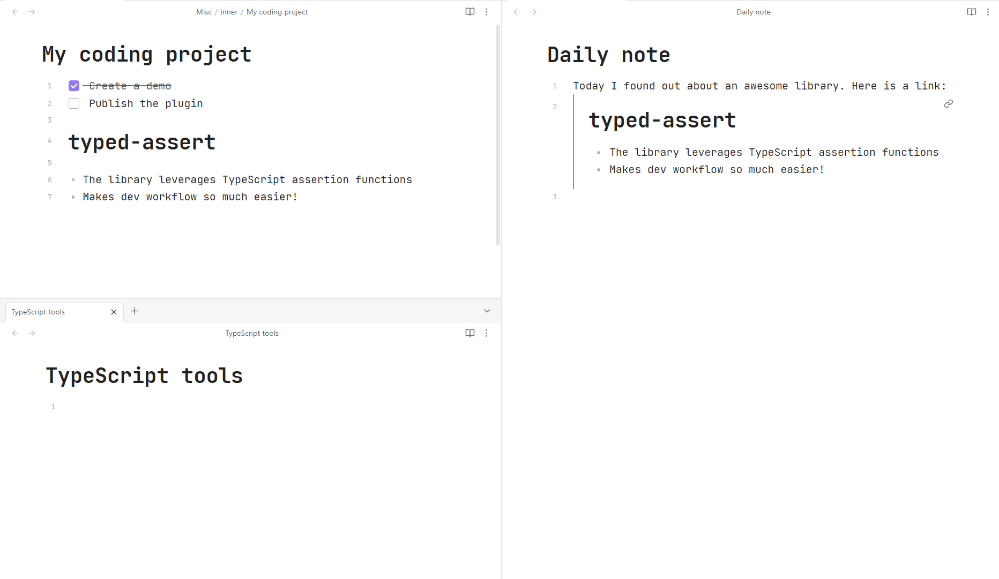

# Persistent Links

Suppose you have a file with backlinks to some of its headings or blocks. Normally if you move these linked-to headings
and blocks, the links are going to break. This plugin listens to cut & paste events and tries to automatically update such links:

## Limitations

- Only works with Wiki links
- Only works with cut + paste events

If you'd like the plugin to support other workflows, don't hesitate to create an
issue: https://github.com/ivan-lednev/obsidian-persistent-links.

