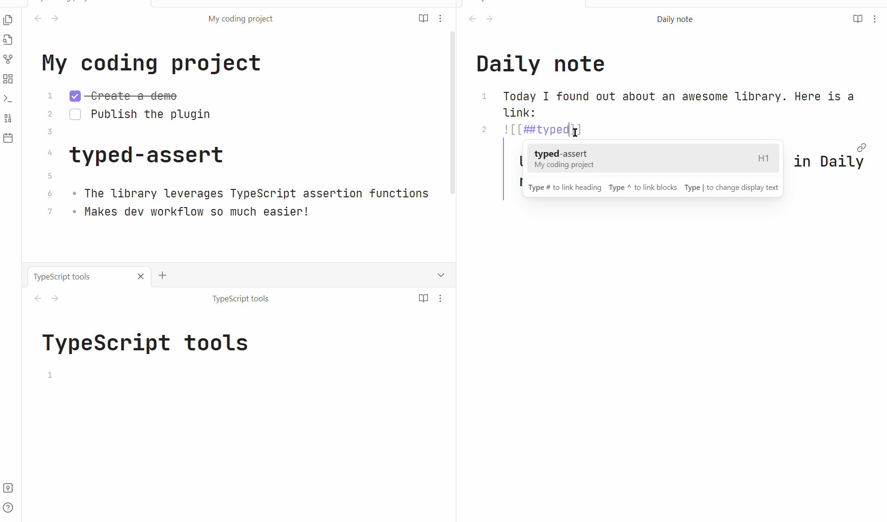

# Persistent Links

## Purpose

Suppose you have a file with backlinks to some of its headings or blocks. Normally if you move these linked-to headings and blocks, the links are going to break. The plugin tries to automatically update such links.

## How to use it

Once you've enabled the plugin, it will automatically update links when you cut and paste headings and blocks. Here is a demo: 

If a file got updated in some other way, and you've noticed some broken links, you can use the "Repair links in file" command to fix them. The plugin will search through the metadata cache and try to find a file that contains the block or heading in the link.

## Limitations

- Partially relies on internal Obsidian APIs, so it may break. If you noticed that, please create an issue
- Automatically works only with cut & paste events
- Only works with Wiki links

If you'd like the plugin to support other workflows, don't hesitate to create an issue: https://github.com/ivan-lednev/obsidian-persistent-links/issues.

## Contribution

If you noticed a bug or thought of some way to improve the plugin, feel free to create an issue: https://github.com/ivan-lednev/obsidian-persistent-links/issues.

Pull-requests are also welcome! If you want to contribute but don't know where to start, you can create an issue or write me an email: <bishop1860@gmail.com>.

You can also support me by buying me a coffee:

